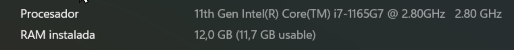
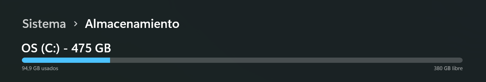

# Environment Details (Windows Test)

For this test, I will be using a Windows laptop with the specifications shown in Figure 1:

> _Figure 1: This information is crucial to understand any potential limitations that may arise._

Regarding storage, there is 380 GB available before the installation of this software, as shown in Figure 2:

> _Figure 2: Knowing the storage aviability, before installing, could help to determine the weights of this software with the LLLM, and the CNN with Fine Tuning, just in case it ends up being a 400 gb / 500 gb app_

On the next page, we will proceed directly to the installation.

